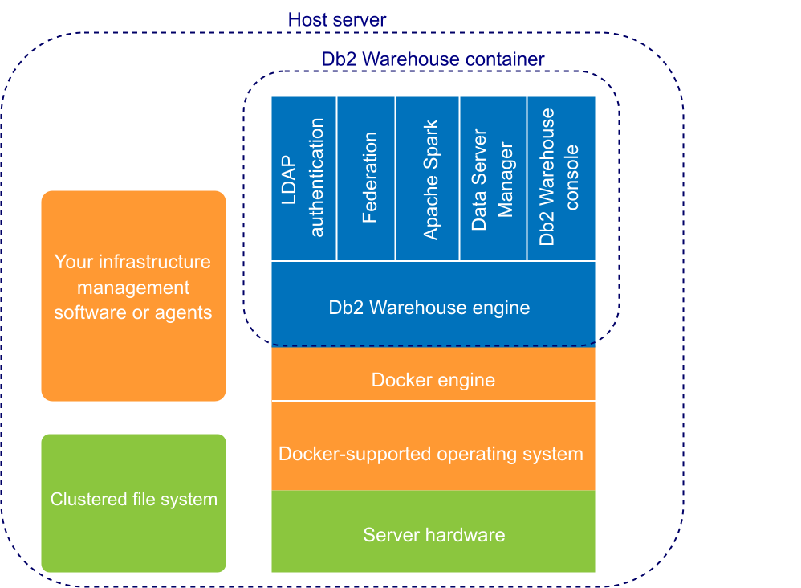
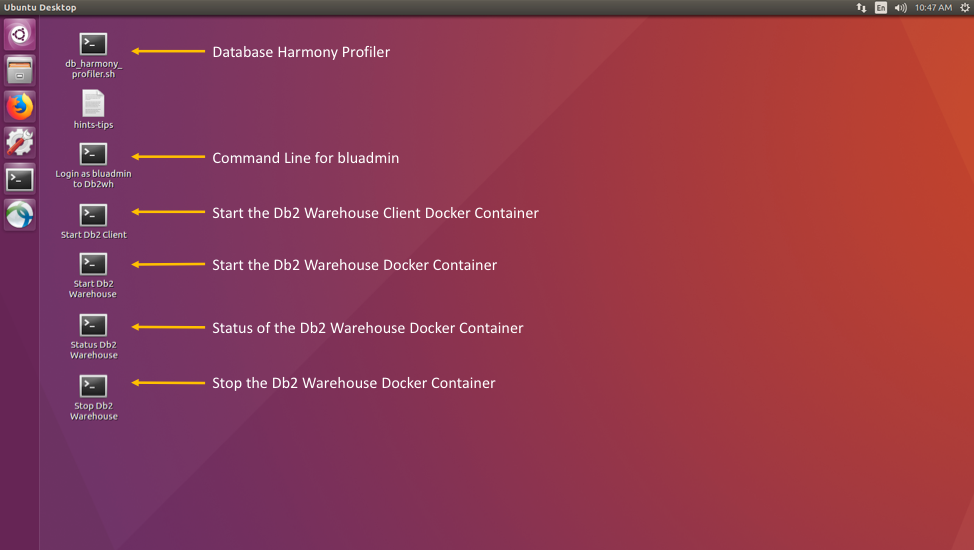
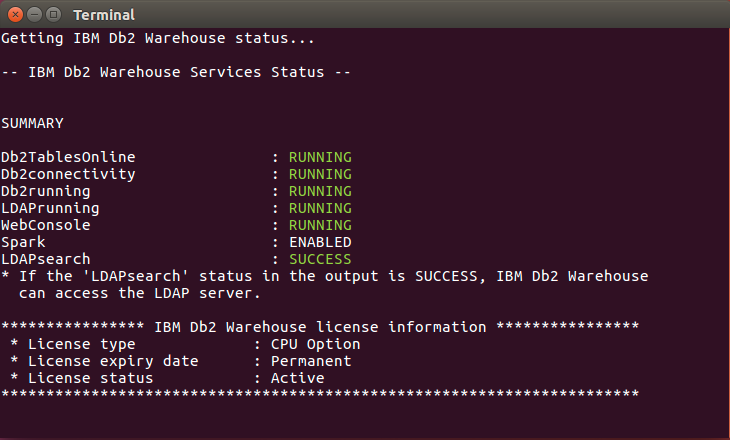
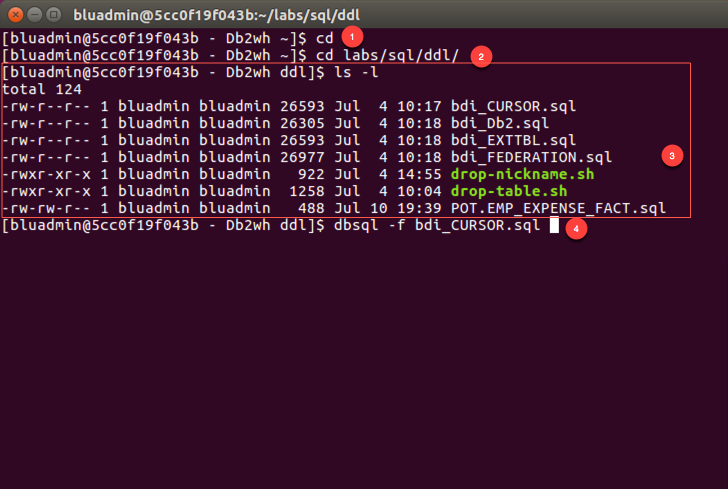
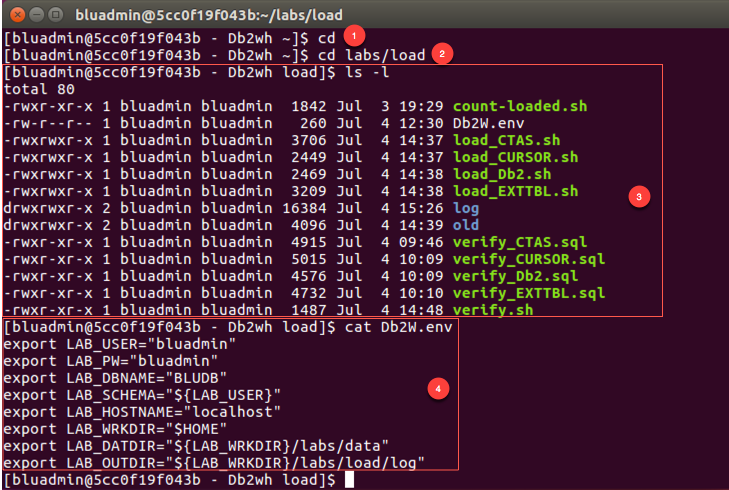

Overview
========

IBM Db2 Warehouse is a software-defined data warehouse for private and virtual clouds that support Docker container technology. It is client managed and optimized for fast and flexible deployment with automated scaling to meet agile analytic workloads. Fusing IBM Db2 BLU and Netezza technologies, Db2 Warehouse offers cloud elasticity combined with the simplicity of a software appliance. It is supported on variety of platforms such as Intel x86, Power and Linux on z and IBM Integrated Analytics System. Db2 Warehouse can also be deployed on IBM Cloud Private platform, IBM Cloud, or any virtual private cloud such as AWS, Microsoft Azure and more.

Introduction
============

Db2 Warehouse is a best-of-breed of database technology that is available in the many deployment form-factors. It combines BLU acceleration with analytical capabilities of Netezza to facilitate analytics for data warehouse. In this Proof-of-Technology, you will learn how to interact with Db2 Warehouse, create tables, load data and query data for exploration. You will also learn how migrated an existing Netezza database into Db2 Warehouse.

Lab 3: Db2 Warehouse Loading Data
=================================

Lab Objectives
---------------

In this section, you will interface with Db2 Warehouse using the command line to load data into tables. You will create four sets of tables and load them using different load methods

You will use the Virtual Machine (VM) provided to perform the exercises below. Inside the Ubuntu VM you are running the Db2 Warehouse software running as a Docker Container.

> VM User ID: sailfish
>
> VM User PW: passw0rd

Db2 Warehouse Overview
----------------------

Db2® Warehouse is an analytics data warehouse that you deploy by using a Docker container. Db2 Warehouse provides control over data and applications but simple deployment and management. The product offers in-memory BLU processing technology and in-database analytics, plus scalability and performance through the MPP architecture. Db2 Warehouse also provides Oracle and Netezza® compatibility.

You can deploy Db2 Warehouse in a wide range of environments, from a basic laptop (our PoT environment) for development and training purposes, all the way to a large production cluster. You can choose either a single-node (SMP) deployment (our lab) or a multi-node (MPP) deployment. (On Windows and Mac, only SMP deployments are supported.) An MPP deployment has a minimum of three nodes and a maximum of either 24 or 60 nodes. The maximum depends on the number of data partitions that were allocated when you deployed.

The containerization technology that Db2 Warehouse uses makes deployment fast and simple. Deployment typically requires fewer than 30 minutes for an MPP cluster and significantly less for SMP. Usually, only one or two commands are required to download and initialize the image. As you can see in Figure 1, the Db2 Warehouse container is lightweight because it doesn’t contain a guest operating system or a hypervisor, as with a VM. The Db2 Warehouse software stack is isolated in its own container, but you can use your existing infrastructure and cloud management or monitoring tools.

*Figure 1: Architecture for Db2 Warehouse.*

IBM® provides two editions of Db2 Warehouse:

-   Db2 Warehouse Enterprise Edition. This is the warranted edition of Db2 Warehouse. You can use this edition in production environments, and it supports both SMP and MPP deployments. It comes with a 90-day trial license so that you can try before buying.

-   Db2 Warehouse Developer Edition. You can use this edition to try out features in your development and test environments; this edition is not intended for production use and is for SMP environments only. This edition is unwarranted and does not come with official IBM support, but you can post questions to the community forum. This edition has a non-expiring free license.

> In this Lab Db2 Warehouse has been set up for you. Details on deploying Db2 Warehouse can be found here: <https://www.ibm.com/support/knowledgecenter/en/SS6NHC/com.ibm.swg.im.dashdb.doc/admin/local_setup.html>

Access the VM Desktop Environment
---------------------------------

1.  Login to VM Desktop:

> VM User ID: sailfish
>
> VM User PW: passw0rd

 

**The VM Desktop**

 For this Lab shortcuts are available on the VM desktop to start/stop, command line, status command line tools. By double clicking these shortcuts you perform the function detailed in the image.

 

Get the Db2 Warehouse Status
----------------------------

1.  Get the status of the Db2 Warehouse Docker Container by double-clicking the “Status Db2 Warehouse” icon on the desktop. A terminal window will open and display the status. 

> All Services should be RUNNING as shown above. If a service isn’t running double click the **Stop Db2 Warehouse** icon. Then click the **Start Db2 Warehouse** icon. Wait a few minutes and then Click the “Status Db2 Warehouse” icon.
>
> Note: if you are working in the IBM Integrated Analytics System environment appliance commands are used the perform these operations from the host operating system such as apstart and apstop.
>
> More details available here: <https://www.ibm.com/support/knowledgecenter/en/SS6NHC/com.ibm.swg.im.iias.admin.doc/doc/appl_apcmds.html>

Perform database operations from the command line.
==================================================

In this section, you will use the command line to perform typical database administrator functions. The command line is a fully functioning Linux environment that can be used for scripting and other common tasks.

Access the command line.
------------------------

1.  On the VM desktop, double click on the shortcut link **Login as** **bluadmin to Db2wh**. This shortcut will open a terminal session connected to the IIAS Db2 Warehouse container, where you will have access to Linux and database commands line tools.

> Note: you can also ssh to directly access to the Db2 Warehouse container. In the IBM Intergrated Analytics system ssh is the primary method to access the command line tools.
>
> Example: ssh potuser01@&lt;VIP&gt; -p 50022
>
> As you can see you are now logged into the Db2 Warehouse container which is a Linux-based OS container with all the appropriate Db2 tools to interact with the database.

Db2 Load Using the Command Line
-------------------------------

The data files have been prepared for you and are located in `~bluadmin/lab/data` on inside the Db2 Warehouse container on the VM.

We will perform the following types of loads: dbload, Db2 LOAD, Db2 LOAD FROM CURSOR and CREATE TABLE AS SELECT... (CTAS. You are likely to use these load options/methods during a POC depending on your goal for the data loading.

1.  dbload (BEST PERFORMANCE)

2.  Db2 LOAD (BEST COMPRESSION)

3.  Db2 LOAD FROM CURSOR (BEST COMPRESSION for Copying data within the cluster and outside the cluster)

4.  CREATE TABLE AS SELECT... (Netezza CTAS Style)

Table and Data Information
--------------------------

  **schema**  |  **table**  |               **file name**  |               **records**  | **size**
  ------------ |------------------------- | ----------------------------- | ------------- | ----------
  BLUADMIN |  CALL_CENTER | CALL_CENTER.del |             15  |  6.7K
  BLUADMIN |  CATALOG_PAGE | CATALOG_PAGE.del  |   11,844   |   1.7M
  BLUADMIN |   CATALOG_RETURNS |         CATALOG_RETURNS.del   |  720,174  |   126M
  BLUADMIN |   CATALOG_SALES  |   CATALOG_SALES.del    |  71,99,490  |   1.7G
  BLUADMIN |   CUSTOMER    |  CUSTOMER.del |    277,001   |    53M
  BLUADMIN |   CUSTOMER_ADDRESS |        CUSTOMER_ADDRESS.del |  138,001 |  23M
  BLUADMIN |   CUSTOMER_DEMOGRAPHICS  |  CUSTOMER_DEMOGRAPHICS.del |   1,920,801  |   115M
  BLUADMIN |  DATE_DIM | DATE_DIM.del  |  73,050 | 12M
  BLUADMIN |  HOUSEHOLD_DEMOGRAPHICS |  HOUSEHOLD_DEMOGRAPHICS.del |  7,201   | 208K
  BLUADMIN |  INCOME_BAND |  INCOME_BAND.del |             21  |   314
  BLUADMIN |  INVENTORY |  INVENTORY.del |                49,329,000  |  920M
  BLUADMIN |   ITEM |   ITEM.del |                      54,001   |     22M
  BLUADMIN |     PROMOTION   |              PROMOTION.del |                389    |       82K
  BLUADMIN |     REASON  |                  REASON.del  |                  40     |       4.9K
  BLUADMIN |     SHIP_MODE    |            SHIP_MODE.del     |           21  |          2.4K
  BLUADMIN |     STORE   |                  STORE.del     |                53     |       18K
  BLUADMIN |     STORE_RETURNS  |          STORE_RETURNS.del   |         1,437,911 |    203M
  BLUADMIN |     STORE_SALES  |            STORE_SALES.del   |           14,400,052  |  2.4G
  BLUADMIN |     TIME_DIM |                 TIME_DIM.del     |            86,401  |      9.4M
  BLUADMIN |     WAREHOUSE  |               WAREHOUSE.del     |            8    |         1.4K
  BLUADMIN |     WEB_PAGE                 WEB_PAGE.del  |               122   |        18K
  BLUADMIN |     WEB_RETURNS  |            WEB_RETURNS.del     |         359,991  |     60M
  BLUADMIN |     WEB_SALES    |            WEB_SALES.del    |            3,599,503  |   864M
  BLUADMIN |     WEB_SITE  |               WE_SITE.del       |          35    |        14K

In this section, you will interface with Db2 Warehouse using the Command Line tools. You will create and load tables.

Access the Db2 Warehouse Container Command Line
-----------------------------------------------

You will use the Virtual Machine (VM) provided to perform the exercises below. Inside the Ubuntu VM you are running the Db2 Warehouse software running as a Docker Container.

> VM User ID: sailfish
>
> VM User PW: passw0rd

Use the launcher on the desktop that is labeled **Login in as bluadmin to Db2wh**. This will open you up to a shell inside the VM’s Db2 Warehouse container as **bluadmin**.

Create the tables needed for the lab.
-------------------------------------

From the Db2 Warehouse Container command line create the four sets of tables using dbsql.

1.  `cd`

2.  `cd ./labs/sql/ddl`

3.  `ls –l`

4.  `dbsql -f bdi_CURSOR.sql`

    

5.  Repeat step 4 for the other DDL files.

    -   `dbsql -f bdi_Db2.sql`

    -   `dbsql -f bdi_EXTTBL.sql`

        bdi_CURSOR.sql -&gt; Db2 LOAD utility using a CURSOR SELECT data from an existing table.

        bdi\_Db2.sql -&gt; Db2 LOAD utility from a CSV file

        bdi\_EXTTBL.sql -&gt; dbload utility utilizing EXTERNAL TABLES

6.  List the tables:

-   `dbsql -schema bluadmin -c "\d" |grep _DBLOAD`

-   `dbsql -schema bluadmin -c "\d" |grep _DB2LOAD`

-   `dbsql -schema bluadmin -c "\d" |grep _CURLOAD`

Load scripts
------------

From the Db2 Warehouse Container command line load the four sets of tables using the scripts provided. Examine the script to see how the tables are loaded. Change to the load scripts directory.

1.  `cd`

2.  `cd ./labs/load`

3.  `ls -l`

4.  `cat Db2W.env`

    

Load tables
-----------

Load the four sets of tables using the following scripts:

1.  dbload (BEST PERFORMANCE)

    -   `./load_EXTTBL.sh | tee load_EXTBL.out`

2.  Db2 LOAD (BEST COMPRESSION)

    -   `./load_Db2.sh | tee load_Db2.out`

3.  Db2 LOAD FROM CURSOR (BEST COMPRESSION for Copying data within the cluster and outside the cluster)

    -   `./load_CURSOR.sh | tee load_CURSOR.out`

4.  CREATE TABLE AS SELECT... (Netezza CTAS Style)

    -   `./load_CTAS.sh | tee load_CTAS.out`

    -   List the CTAS tables:

        -   `dbsql -schema bluadmin -c "\d" |grep _CTAS`

Verify data loads
-----------------

Verify the four sets of tables loaded using the following scripts:

1.  `db2 connect to bludb`

2.  dbload (BEST PERFORMANCE)

    -   `db2 –tvf ./verify_EXTTBL.sql | tee verify\_EXTBL.out`

3.  Db2 LOAD (BEST COMPRESSION)

    -   `db2 –tvf ./verify_Db2.sql | tee verify_Db2.out`

4.  Db2 LOAD FROM CURSOR (BEST COMPRESSION for Copying data within the cluster and outside the cluster)

    -   `db2 –tvf ./verify_CURSOR.sql | tee verify_CURSOR.out`

5.  CREATE TABLE AS SELECT... (Netezza CTAS Style)

    -   `db2 –tvf ./verify_CTAS.sql | tee verify_CTAS.out`

Congratulations
---------------

You have completed the tutorial for IBM Integrated Analytics System.

Notices
=======

This information was developed for products and services offered in the U.S.A.

IBM may not offer the products, services, or features discussed in this document in other countries. Consult your local IBM representative for information on the products and services currently available in your area. Any reference to an IBM product, program, or service is not intended to state or imply that only that IBM product, program, or service may be used. Any functionally equivalent product, program, or service that does not infringe any IBM intellectual property right may be used instead. However, it is the user's responsibility to evaluate and verify the operation of any non-IBM product, program, or service.

IBM may have patents or pending patent applications covering subject matter described in this document. The furnishing of this document does not grant you any license to these patents. You can send license inquiries, in writing, to:

IBM Director of Licensing\
IBM Corporation\
North Castle Drive\
Armonk, NY 10504-1785\
USA

For license inquiries regarding double-byte (DBCS) information, contact the IBM Intellectual Property Department in your country or send inquiries, in writing, to:

IBM World Trade Asia Corporation\
Licensing\
2-31 Roppongi 3-chome, Minato-ku\
Tokyo 106-0032, Japan

**The following paragraph does not apply to the United Kingdom or any other country where such provisions are inconsistent with local law:** INTERNATIONAL BUSINESS MACHINES CORPORATION PROVIDES THIS PUBLICATION "AS IS" WITHOUT WARRANTY OF ANY KIND, EITHER EXPRESS OR IMPLIED, INCLUDING, BUT NOT LIMITED TO, THE IMPLIED WARRANTIES OF NON-INFRINGEMENT, MERCHANTABILITY OR FITNESS FOR A PARTICULAR PURPOSE. Some states do not allow disclaimer of express or implied warranties in certain transactions, therefore, this statement may not apply to you.

This information could include technical inaccuracies or typographical errors. Changes are periodically made to the information herein; these changes will be incorporated in new editions of the publication. IBM may make improvements and/or changes in the product(s) and/or the program(s) described in this publication at any time without notice.

Any references in this information to non-IBM web sites are provided for convenience only and do not in any manner serve as an endorsement of those web sites. The materials at those Web sites are not part of the materials for this IBM product and use of those web sites is at your own risk.

IBM may use or distribute any of the information you supply in any way it believes appropriate without incurring any obligation to you.

Any performance data contained herein was determined in a controlled environment. Therefore, the results obtained in other operating environments may vary significantly. Some measurements may have been made on development-level systems and there is no guarantee that these measurements will be the same on generally available systems. Furthermore, some measurements may have been estimated through extrapolation. Actual results may vary. Users of this document should verify the applicable data for their specific environment.

Information concerning non-IBM products was obtained from the suppliers of those products, their published announcements or other publicly available sources. IBM has not tested those products and cannot confirm the accuracy of performance, compatibility or any other claims related to non-IBM products. Questions on the capabilities of non-IBM products should be addressed to the suppliers of those products.

All statements regarding IBM's future direction and intent are subject to change or withdrawal without notice, and represent goals and objectives only.

This information contains examples of data and reports used in daily business operations. To illustrate them as completely as possible, the examples include the names of individuals, companies, brands, and products. All of these names are fictitious and any similarity to the names and addresses used by an actual business enterprise is entirely coincidental. All references to fictitious companies or individuals are used for illustration purposes only.

COPYRIGHT LICENSE:

This information contains sample application programs in source language, which illustrate programming techniques on various operating platforms. You may copy, modify, and distribute these sample programs in any form without payment to IBM, for the purposes of developing, using, marketing or distributing application programs conforming to the application programming interface for the operating platform for which the sample programs are written. These examples have not been thoroughly tested under all conditions. IBM, therefore, cannot guarantee or imply reliability, serviceability, or function of these programs.

Trademarks and copyrights
=========================

The following terms are trademarks of International Business Machines Corporation in the United States, other countries, or both:

IBM IBM logo 1-2-3 AIX DB2 IMS

Lotus Cloudant Sametime IBM Data Studio DCW

Adobe, the Adobe logo, PostScript, and the PostScript logo are either registered trademarks or trademarks of Adobe Systems Incorporated in the United States, and/or other countries.

IT Infrastructure Library is a registered trademark of the Central Computer and Telecommunications Agency which is now part of the Office of Government Commerce.

Intel, Intel logo, Intel Inside, Intel Inside logo, Intel Centrino, Intel Centrino logo, Celeron, Intel Xeon, Intel SpeedStep, Itanium, and Pentium are trademarks or registered trademarks of Intel Corporation or its subsidiaries in the United States and other countries.

Linux is a registered trademark of Linus Torvalds in the United States, other countries, or both.

Microsoft, Windows, Windows NT, and the Windows logo are trademarks of Microsoft Corporation in the United States, other countries, or both.

Oracle is a registered trademark of Oracle Corporation and/or its affiliates.

ITIL is a registered trademark, and a registered community trademark of The Minister for the Cabinet Office, and is registered in the U.S. Patent and Trademark Office.

UNIX is a registered trademark of The Open Group in the United States and other countries.

Java and all Java-based trademarks and logos are trademarks or registered trademarks of Oracle and/or its affiliates.

Cell Broadband Engine is a trademark of Sony Computer Entertainment, Inc. in the United States, other countries, or both and is used under license therefrom.

Linear Tape-Open, LTO, the LTO Logo, Ultrium, and the Ultrium logo are trademarks of HP, IBM Corp. and Quantum in the U.S. and other countries.

© Copyright IBM Corporation 2017.

The information contained in these materials is provided for informational purposes only, and is provided AS IS without warranty of any kind, express or implied. IBM shall not be responsible for any damages arising out of the use of, or otherwise related to, these materials. Nothing contained in these materials is intended to, nor shall have the effect of, creating any warranties or representations from IBM or its suppliers or licensors, or altering the terms and conditions of the applicable license agreement governing the use of IBM software. References in these materials to IBM products, programs, or services do not imply that they will be available in all countries in which IBM operates. This information is based on current IBM product plans and strategy, which are subject to change by IBM without notice. Product release dates and/or capabilities referenced in these materials may change at any time at IBM’s sole discretion based on market opportunities or other factors, and are not intended to be a commitment to future product or feature availability in any way.

IBM, the IBM logo and ibm.com are trademarks of International Business Machines Corp., registered in many jurisdictions worldwide. Other product and service names might be trademarks of IBM or other companies. A current list of IBM trademarks is available on the web at “Copyright and trademark information” at www.ibm.com/legal/copytrade.shtml.

