Overview
========

IBM Db2 Warehouse is a software-defined data warehouse for private and virtual clouds that support Docker container technology. It is client managed and optimized for fast and flexible deployment with automated scaling to meet agile analytic workloads. Fusing IBM Db2 BLU and Netezza technologies, Db2 Warehouse offers cloud elasticity combined with the simplicity of a software appliance. It is supported on variety of platforms such as Intel x86, Power and Linux on z and IBM Integrated Analytics System. Db2 Warehouse can also be deployed on IBM Cloud Private platform, IBM Cloud, or any virtual private cloud such as AWS, Microsoft Azure and more.

Introduction
============

Db2 Warehouse is a best-of-breed of database technology that is available in the many deployment form-factors. It combines BLU acceleration with analytical capabilities of Netezza to facilitate analytics for data warehouse. In this Proof-of-Technology, you will learn how to interact with Db2 Warehouse, create tables, load data and query data for exploration. You will also learn how migrated an existing Netezza database into Db2 Warehouse.

Lab 1: Db2 Warehouse Web Console
================================

Lab Objectives
---------------

In this section, you will interface with Db2 Warehouse using the Web Console. You will create a schema, table, load a table and query tables already loaded .

You will use the Virtual Machine (VM) provided to perform the exercises below. Inside the Ubuntu VM you are running the Db2 Warehouse software running as a Docker Container.

> VM User ID: sailfish
>
> VM User PW: passw0rd

Db2 Warehouse Overview
----------------------

Db2® Warehouse is an analytics data warehouse that you deploy by using a Docker container. Db2 Warehouse provides control over data and applications but simple deployment and management. The product offers in-memory BLU processing technology and in-database analytics, plus scalability and performance through the MPP architecture. Db2 Warehouse also provides Oracle and Netezza® compatibility.

You can deploy Db2 Warehouse in a wide range of environments, from a basic laptop (our PoT environment) for development and training purposes, all the way to a large production cluster. You can choose either a single-node (SMP) deployment (our lab) or a multi-node (MPP) deployment. (On Windows and Mac, only SMP deployments are supported.) An MPP deployment has a minimum of three nodes and a maximum of either 24 or 60 nodes. The maximum depends on the number of data partitions that were allocated when you deployed.

The containerization technology that Db2 Warehouse uses makes deployment fast and simple. Deployment typically requires fewer than 30 minutes for an MPP cluster and significantly less for SMP. Usually, only one or two commands are required to download and initialize the image. As you can see in Figure 1, the Db2 Warehouse container is lightweight because it doesn’t contain a guest operating system or a hypervisor, as with a VM. The Db2 Warehouse software stack is isolated in its own container, but you can use your existing infrastructure and cloud management or monitoring tools.

*Figure 1: Architecture for Db2 Warehouse.*

IBM® provides two editions of Db2 Warehouse:

-   Db2 Warehouse Enterprise Edition. This is the warranted edition of Db2 Warehouse. You can use this edition in production environments, and it supports both SMP and MPP deployments. It comes with a 90-day trial license so that you can try before buying.

-   Db2 Warehouse Developer Edition. You can use this edition to try out features in your development and test environments; this edition is not intended for production use and is for SMP environments only. This edition is unwarranted and does not come with official IBM support, but you can post questions to the community forum. This edition has a non-expiring free license.

> In this Lab Db2 Warehouse has been set up for you. Details on deploying Db2 Warehouse can be found here: <https://www.ibm.com/support/knowledgecenter/en/SS6NHC/com.ibm.swg.im.dashdb.doc/admin/local_setup.html>

Access the VM Desktop Environment
---------------------------------

1.  Login to VM Desktop:

> VM User ID: sailfish
>
> VM User PW: passw0rd
>
> 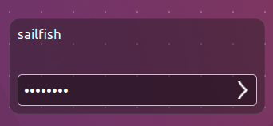
>
> **The VM Desktop **
>
> For this Lab shortcuts are available on the VM desktop to start/stop, command line, status command line tools. By double clicking these shortcuts you perform the function detailed in the image.
>
> 

Get the Db2 Warehouse Status
----------------------------

1.  Get the status of the Db2 Warehouse Docker Container by double-clicking the “Status Db2 Warehouse” icon on the desktop. A terminal window will open and display the status. 

> All Services should be RUNNING as shown above. If a service isn’t running double click the **Stop Db2 Warehouse** icon. Then click the **Start Db2 Warehouse** icon. Wait a few minutes and then Click the “Status Db2 Warehouse” icon.
>
> ***Note***: if you are working in the IBM Integrated Analytics System environment appliance commands are used the perform these operations from the host operating system such as apstart and apstop.
>
> More details available here: <https://www.ibm.com/support/knowledgecenter/en/SS6NHC/com.ibm.swg.im.iias.admin.doc/doc/appl_apcmds.html>

Add POT folder to Desktop
-------------------------
1. Right click and download the following zip file. <a href="PoT.zip" download>Click to Download</a>
1. Extract this to `/home/sailfish/Desktop`

Sign-in to the Web Console
--------------------------

1.  Click the Firefox Icon on the left of the Desktop.

> 

-  Enter the following in the URL bar:

> <https://172.18.0.2:8443/console/dsconsolelib/shared/login/loginrepauth.jsp>
>
> or click the 172.18.0.2 icon.

1.  Login to the Web Console

-   Use the following user IDs and password:

> 
>
> VM User ID: bluadmin
>
> VM User PW: bluadmin
>
> As the bluadmin user or another administrator you will see the administrative options in the console. Go ahead and explore the console. When you are ready for the next step click IBM Db2 Warehouse at the top lef of the screen to return the to the Welcome to IBM Db2 Warehouse home page.
>
> 

Create a Db2 Warehouse User
---------------------------

1.  From the top left corner of the screen, press the **Options** button (“hamburger” button) to expand the menu.

2.  Select **SETTINGS**.

3.  In the expanded options under **SETTINGS**, select **Users and Privileges**.

4.  You will see a list of existing users, along with their user ID, user name, email, whether they have admin privileges. The last column shows the actions you can take such as edit or remove the user.

5.  Click on the **Add** button below the Users tab.

6.  In the Add new user window, enter the following information

    -   User ID: potuser01

    -   Name: pot user

    -   Email: enter your email

    -   Password: Potuser01_123 (Note: password is case sensitive so you will need enter exactly as shown)

    -   Confirm the password: Potuser01_123

        -   Note that the password must match all the criteria, including mixed case letters, at least 1 number and a special symbol and satisfies the length requirement.

    -   Leave User Privilege field as the default with the **User** option checked.

    -   Click on **Create**.

> 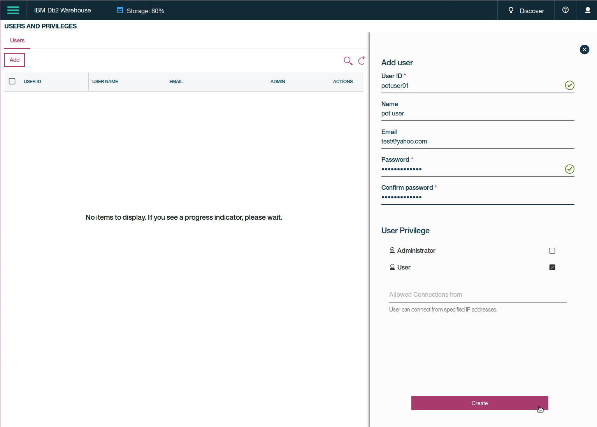

-   You should see a **SUCCESS** message displayed as the user is created.

-   Click on **Close** to close the Create User window.

> 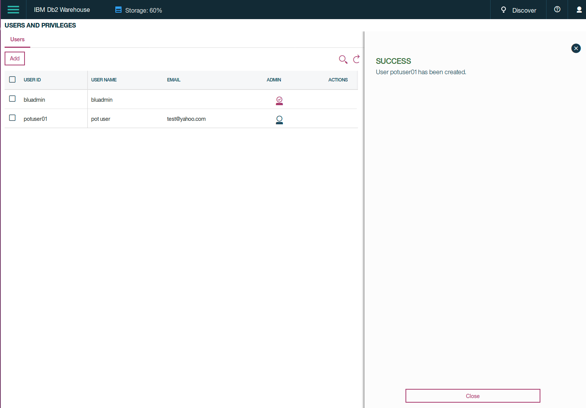

Login as the New Web Console User
---------------------------------

1.  We will switch users now to explore what a typical user will see as they log into the Web console. First log out of the current user by clicking on **Person** icon at the top right corner.

2.  Click on **Sign out** at the bottom of the drop-down menu.

> 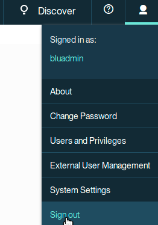

1.  Confirm signing out by clicking on **Yes** on the pop up window

2.  On the log in screen, enter the credential of the new user we created in the previous section

3.  User name: potuser01

    -   Password: Potuser01_123 (Note: password is case sensitive)

    -   Click on the **Sign in** button

> 

-   Notice right away that the log in screen looks different when you log in as a user rather than an administrator. Browse through the available menus.

-   Explore the Web Console for a regular user.

-   **Logout and login as** bluadmin **again.**

Create a Schema as bluadmin
---------------------------

1.  From the top left corner of the screen, press the **Options** button (“hamburger” button) to expand the menu.

2.  Select **ADMINISTER** in the drop-down menu.

3.  Click on **Schemas**

4.  Click **Create**

5.  Enter the schema name: POT

6.  Click the **+** to display the SQL command

7.  Click on the **Run** button.

> 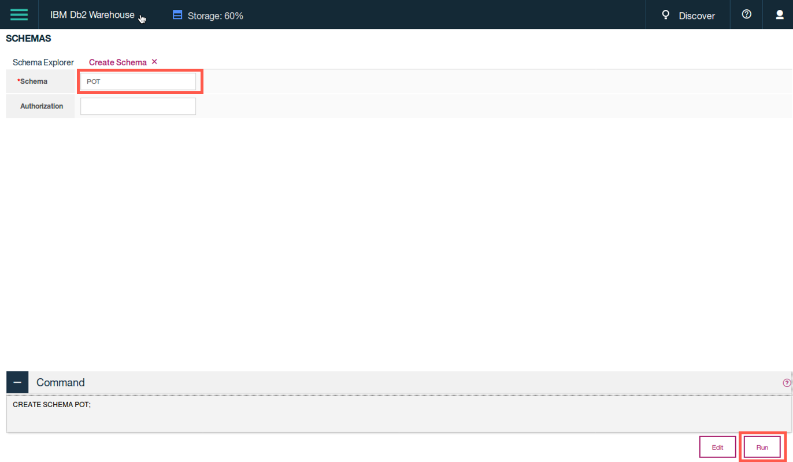

1.  Click **Close**

2.  Enter %POT% in the **Filter by Name** field and press enter.

3.  Notice that the new schema is now listed in the list of available schemas.

> 

1.  New schema created.

Create a table
--------------

Next, we will create new table in the POT schema. We will do this using a script stored on the VM.

1.  Create tables, from the top left corner of the screen, press the **Options** button (“hamburger” button) to expand the menu.

2.  Select **Run SQL** in the drop-down menu.

3.  Run SQL menu option

4.  Click on the Script button, and select **Open from client**

5.  In the pop up window, select **Browse**.

6.  In the **File Upload** window, click on the **Desktop** icon,

7.  Double click the folder **POT**

8.  Double click on the folder **DDL_Go_Sales_DW**

9.  Select the file **POT_DDL_gosalesdw.ddl**

10. Click the **Open** button.

> 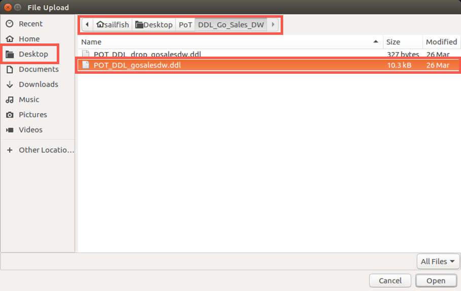

1.  The file is now selected, click **OK** to confirm the selection. The content of the file is now displayed in the SQL editor.

> 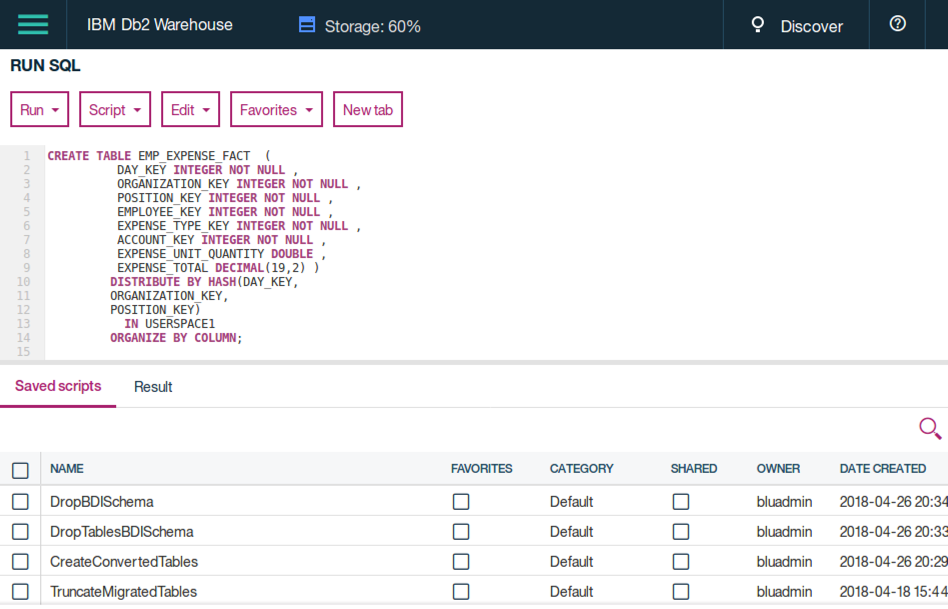

1.  Click on the Run button, then select Run all from the menu.

2.  The bottom portion of the window is automatically switched to the **Result** tab. You can see the status of run and click on the line items to view the detail of the execution on the right side.

> 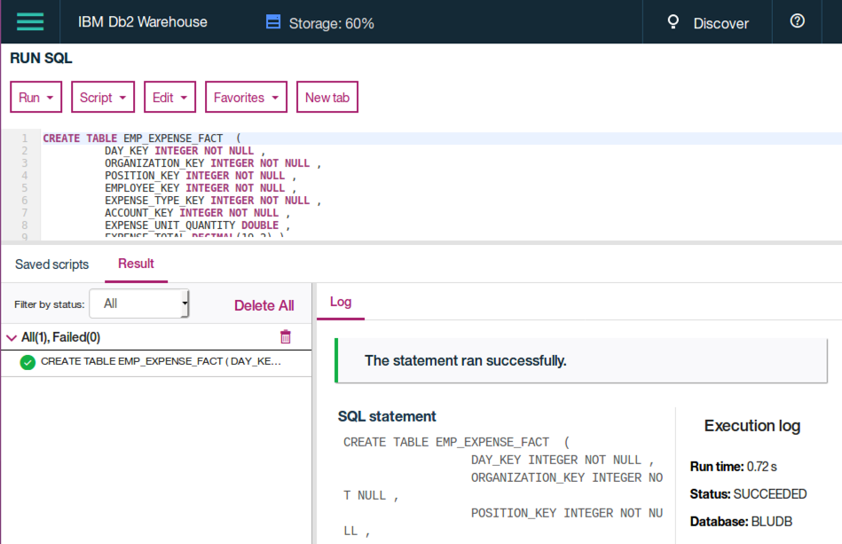

-   Results of the run

-   Make sure there are no errors. The statement should have a green check symbol next to it.

-   When the table is created press the Options button (“hamburger” button) to expand the menu and select “**ADMINISTER**” in the drop-down menu.

-   Administer menu option

<!-- -->

-   From the top left corner of the screen, press the Options button (“hamburger” button) to expand the menu.

-   Select **Tables**.

-   Enter **EMP_EXPENSE_FACT** in the **Filter by name** field and press enter.

-   Click on the table **EMP_EXPENSE_FACT** with the “BLUADMIN” schema.

-   

-   Explore the available tabs: Properties, Columns, Constraints, Statistics, Dependencies.

Load data using the Web Console
--------------------------------

We will start loading data into the table we just created.

-   From the top left corner of the screen, press the Options button (“hamburger” button) to expand the menu.

-   Select Load in the drop-down menu.

-   Select “Load from file”

-   Click “Choose a file”

-   Click Desktop

-   Double Click the folder “POT”

-   Double Click the folder “Data_Go_Sales_DW”

-   Select the file “EMP_EXPENSE_FACT.csv”

-   Click on the Open button.

> 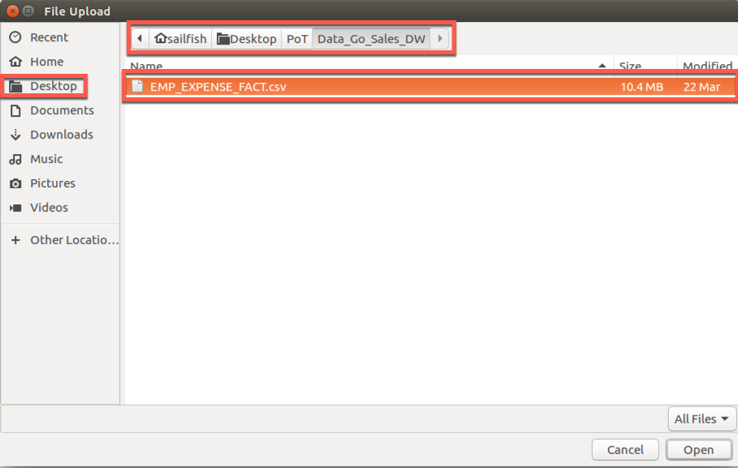

-   Select “No” for Does row one contain the column names?

-   Click the “Preview” button at the bottom right corner of the screen to advance to the Target step.

> 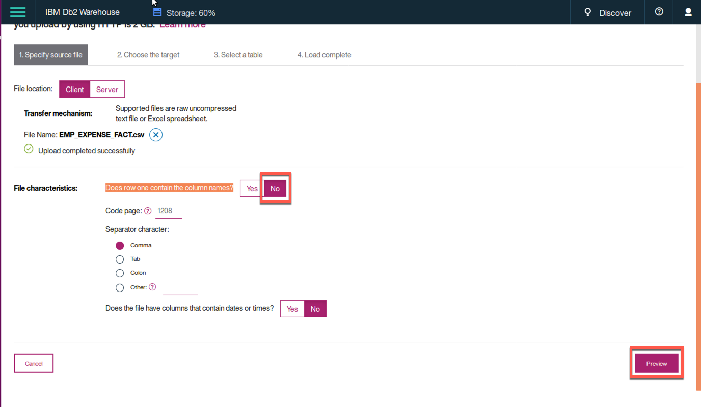

-   Review the data preview screen.

-   Click “Next”

-   Select “Load into an existing table” and click “Next”

-   We will select the load target. First select the schema POT.

-   In the tables list, select EMP_EXPENSE_FACT. The table definition will be shown on the right. Notice you have the option to append new data to the table or overwrite the table with new data. In this case, since the table is empty, either option will give us the same result. We will leave it as the default.

> 

-   Click **Finish**

-   When the load is completed, you will see the statistics displayed, such as number of rows read, loaded and rejected, the duration of the load and any errors or warnings associated with this load job.

> 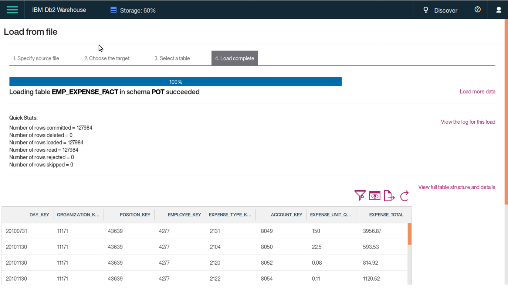

-   Load completed

-   Minimize or close your browser to display the Windows VM desktop.

Query data from the console
---------------------------

Another method to query tables in the database is through the Web Console. Let’s bring up the console if it isn’t already running.

1.  Click the Firefox Icon on the left of the Desktop.

> 

-   Enter the following in the URL bar:

> <https://172.18.0.2:8443/console/dsconsolelib/shared/login/loginrepauth.jsp>
>
> or click the 172.18.0.2 icon

1.  Login to the Web Console

-   Use the following user IDs and password:

> 
>
> VM User ID: bluadmin
>
> VM User PW: bluadmin

1.  Before we run SQL, let’s go back to explore the tables we loaded. From the top left corner of the screen, press the Options button (“hamburger” button) to expand the menu.

    -   Select **Run SQL** in menu.

    -   Run SQL menu option

        -   In the editor type the following query

        -   select \* from gosalesdw.emp_employee_dim;

        -   Select **Run all** from the Run drop down box.

        -   The results are displayed on the bottom right, you can scroll through the results.

            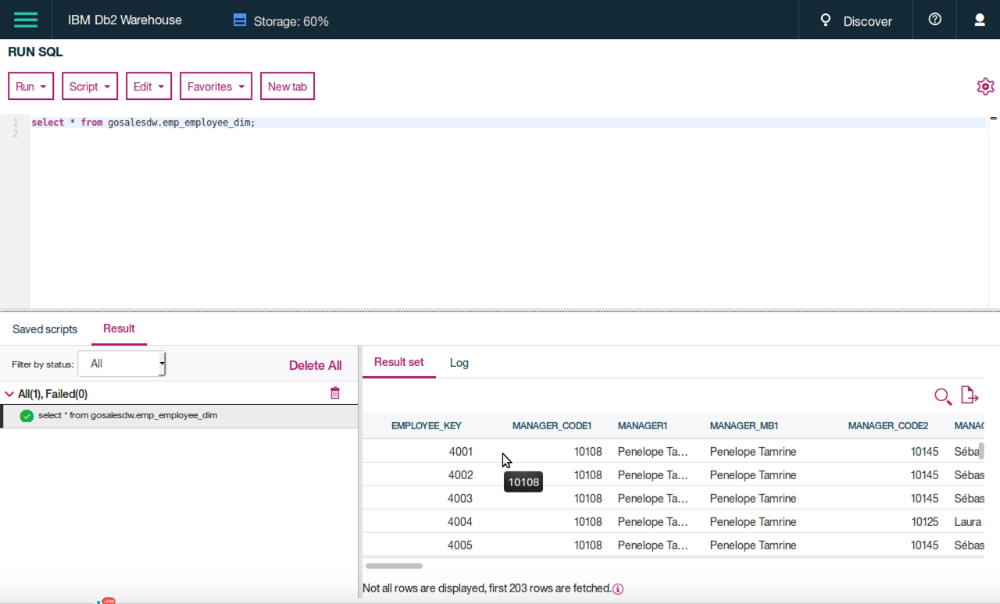

2.  Next let’s run the seven queries that we ran from the command line using dbsql. Select the **Script** button from the **RUN SQL** page and select **Open from client**.

3.  Navigate to the folder POT asset by clicking on the folder name under Favorites in the left panel.

4.  Next, we will select the folder SQL_Go_Sales_DW by double clicking on the folder name.

5.  Select folder “SQL_Go_Sales_DW”

    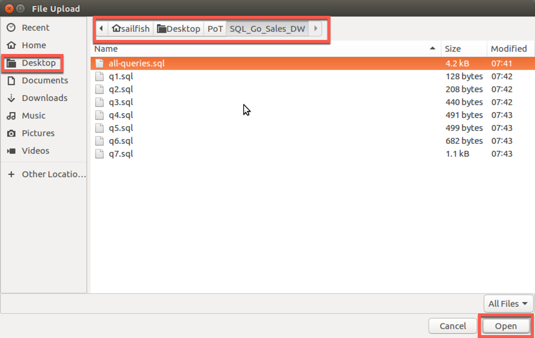

6.  Select the file called **all-queries.sql**, click the **Open** button and click **OK**. The queries should be loaded into the editor. Review the queries.

    

7.  Review content of SQL script

8.  Execute the queries by clicking the **Run** button and selecting **Run All**.

9.  The execution results are show on the bottom left and the query results on the bottom right.

10. Examine the results by clicking on the queries in the Results window.

    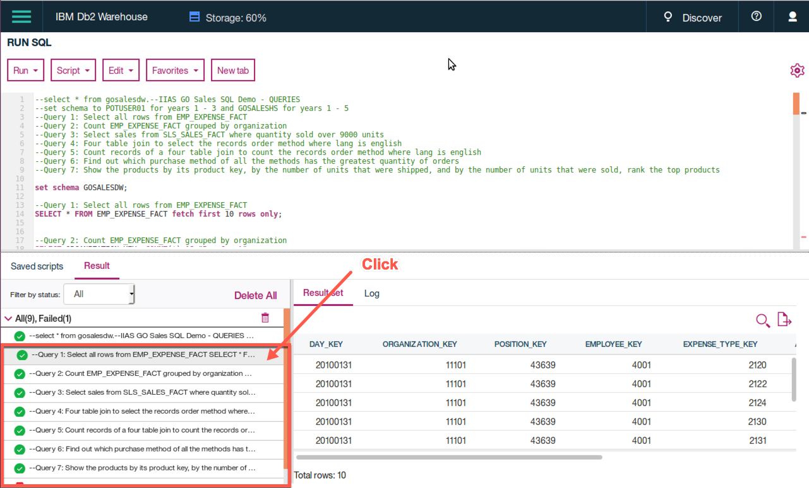

11. Generate an explain plan for one of the queries.

-   From the top left corner of the screen, press the Options button (“hamburger” button) to expand the menu.

-   Select **Run SQL**

-   Clear out SQL from the editor if necessary, **CTRL+A and DEL**

-   Select the **Script** drop-down button and select **Open From Client**

-   From the **Open script** window select **Browse**

-   Click **Home**

-   Double click **Desktop**

-   Double click the folder **PoT**

-   Double click the folder **SQL_Go_Sales_DW**

-   Select q7-explain.sql

-   Click **Open**

-   Click **OK** from the Open script window to load the query into the editor

-   Select the **Run** button

-   Select **Explain**

-   Examine the explain plan.

    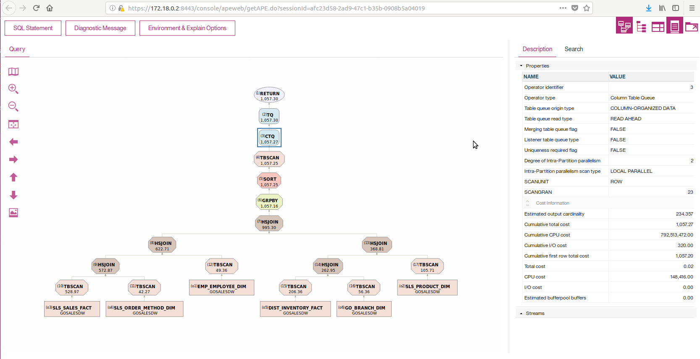

<!-- -->

-   Click on the **CTQ** operator to display the description on the right.

    -   Read explains bottom to top.

    -   Explains represent our most granular form of diagnostics for query performance analysis

    -   CTQ operator denotes boundary between row and column oriented processing for Db2 BLU

    -   Key points for analyzing column-oriented processing with explains

        -   Position of CTQ in the plan indicates how much Db2 is able to leverage the columnar runtime

        -   Also look at the cardinalities (including section actuals) for number of rows flowing out of the CTQ into row-oriented processing

        -   Look for incompatible query constructs, or row oriented data objects that may cause portions of the plan to revert to row-oriented processing

-   Close the Query Graph by pressing CTRL+W

1.  Logout of the console by clicking the Person icon on the top right, click Sign out and click OK.

Congratulations

You have completed the Web Console Lab for IBM Db2 Warehouse / IBM Integrated Analytics System.
