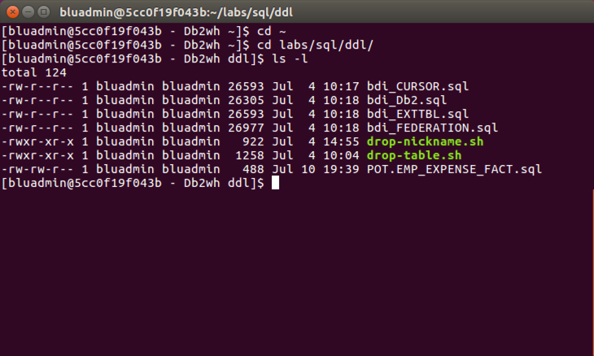
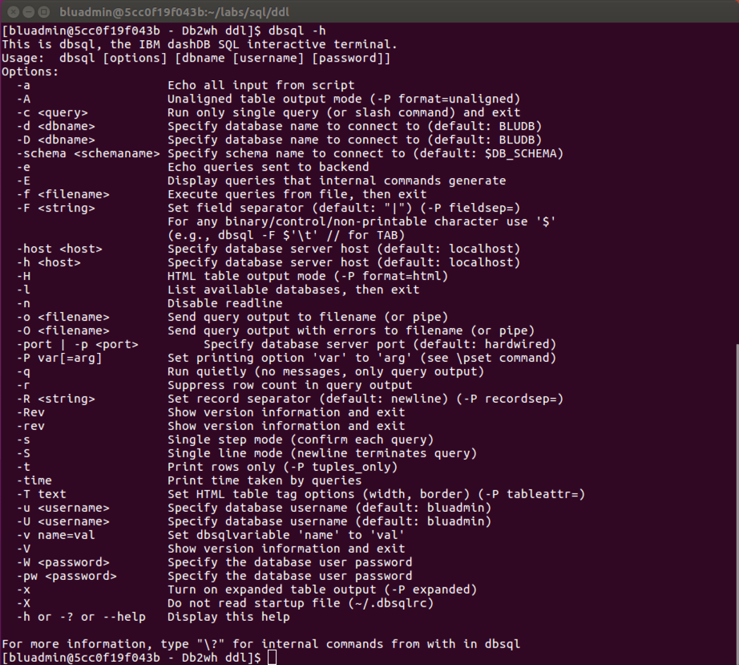

Lab Exercise 2

Overview
========

IBM Db2 Warehouse is a software-defined data warehouse for private and virtual clouds that support Docker container technology. It is client managed and optimized for fast and flexible deployment with automated scaling to meet agile analytic workloads. Fusing IBM Db2 BLU and Netezza technologies, Db2 Warehouse offers cloud elasticity combined with the simplicity of a software appliance. It is supported on variety of platforms such as Intel x86, Power and Linux on z and IBM Integrated Analytics System. Db2 Warehouse can also be deployed on IBM Cloud Private platform, IBM Cloud, or any virtual private cloud such as AWS, Microsoft Azure and more.

Introduction
============

Db2 Warehouse is a best-of-breed of database technology that is available in the many deployment form-factors. It combines BLU acceleration with analytical capabilities of Netezza to facilitate analytics for data warehouse. In this Proof-of-Technology, you will learn how to interact with Db2 Warehouse, create tables, load data and query data for exploration. You will also learn how migrated an existing Netezza database into Db2 Warehouse.

Lab 2: Db2 Command Line
=======================

Lab Objectives
---------------

In this section, you will interface with Db2 Warehouse using the Command Line tools. You will query tables already created and loaded.

You will use the Virtual Machine (VM) provided to perform the exercises below. Inside the Ubuntu VM you are running the Db2 Warehouse software running as a Docker Container.

> VM User ID: sailfish
>
> VM User PW: passw0rd

Db2 Warehouse Overview
----------------------

Db2® Warehouse is an analytics data warehouse that you deploy by using a Docker container. Db2 Warehouse provides control over data and applications but simple deployment and management. The product offers in-memory BLU processing technology and in-database analytics, plus scalability and performance through the MPP architecture. Db2 Warehouse also provides Oracle and Netezza® compatibility.

You can deploy Db2 Warehouse in a wide range of environments, from a basic laptop (our PoT environment) for development and training purposes, all the way to a large production cluster. You can choose either a single-node (SMP) deployment (our lab) or a multi-node (MPP) deployment. (On Windows and Mac, only SMP deployments are supported.) An MPP deployment has a minimum of three nodes and a maximum of either 24 or 60 nodes. The maximum depends on the number of data partitions that were allocated when you deployed.

The containerization technology that Db2 Warehouse uses makes deployment fast and simple. Deployment typically requires fewer than 30 minutes for an MPP cluster and significantly less for SMP. Usually, only one or two commands are required to download and initialize the image. As you can see in Figure 1, the Db2 Warehouse container is lightweight because it doesn’t contain a guest operating system or a hypervisor, as with a VM. The Db2 Warehouse software stack is isolated in its own container, but you can use your existing infrastructure and cloud management or monitoring tools.

*Figure 1: Architecture for Db2 Warehouse.*

IBM® provides two editions of Db2 Warehouse:

-   Db2 Warehouse Enterprise Edition. This is the warranted edition of Db2 Warehouse. You can use this edition in production environments, and it supports both SMP and MPP deployments. It comes with a 90-day trial license so that you can try before buying.

-   Db2 Warehouse Developer Edition. You can use this edition to try out features in your development and test environments; this edition is not intended for production use and is for SMP environments only. This edition is unwarranted and does not come with official IBM support, but you can post questions to the community forum. This edition has a non-expiring free license.

> In this Lab Db2 Warehouse has been set up for you. Details on deploying Db2 Warehouse can be found here: <https://www.ibm.com/support/knowledgecenter/en/SS6NHC/com.ibm.swg.im.dashdb.doc/admin/local_setup.html>

Access the VM Desktop Environment
---------------------------------

1.  Login to VM Desktop:

> VM User ID: sailfish
>
> VM User PW: passw0rd
>
> 
>
> **The VM Desktop **
>
> For this Lab shortcuts are available on the VM desktop to start/stop, command line, status command line tools. By double clicking these shortcuts you perform the function detailed in the image.
>
> 

Get the Db2 Warehouse Status
----------------------------

1.  Get the status of the Db2 Warehouse Docker Container by double-clicking the “Status Db2 Warehouse” icon on the desktop. A terminal window will open and display the status. 

> All Services should be RUNNING as shown above. If a service isn’t running double click the **Stop Db2 Warehouse** icon. Then click the **Start Db2 Warehouse** icon. Wait a few minutes and then Click the “Status Db2 Warehouse” icon.
>
> Note: if you are working in the IBM Integrated Analytics System environment appliance commands are used the perform these operations from the host operating system such as apstart and apstop.
>
> More details available here: <https://www.ibm.com/support/knowledgecenter/en/SS6NHC/com.ibm.swg.im.iias.admin.doc/doc/appl_apcmds.html>

Perform database operations from the command line.
==================================================

In this section, you will use the command line to perform typical database administrator functions. The command line is a fully functioning Linux environment that can be used for scripting and other common tasks.

Access the command line.
------------------------

1.  On the VM desktop, double click on the shortcut link **Login as** **bluadmin to Db2wh**. This shortcut will open a terminal session connected to the IIAS Db2 Warehouse container, where you will have access to Linux and database commands line tools.

> Note: you can also ssh to directly access to the Db2 Warehouse container. In the IBM Intergrated Analytics system ssh is the primary method to access the command line tools.
>
> Example: ssh potuser01@&lt;VIP&gt; -p 50022
>
> As you can see you are now logged into the Db2 Warehouse container which is a Linux-based OS container with all the appropriate Db2 tools to interact with the database.

Create a table from the with dbsql command line tool
----------------------------------------------------

1.  Access the SQL files from a terminal session

    `cd ~`

    `cd labs/sql/ddl`

    `ls -l`

    

2.  To use the dbsql tool you can set the environment variables for the dbtool kit by adding the following into your .bashrc file. This has already been done for you. This allows you to run dbsql without providing the hostname, database, user and password.

    To view the settings:
    ~~~
    grep DB_ ~/.bashrc

    export DB_HOST=localhost

    export DB_DATABASE=BLUDB

    export DB_USER=bluadmin

    export DB_PASSWORD=bluadmin
    ~~~
3.  Get dbsql help

   `dbsql –h`

    

4.  Create the table EMP_EXPENSE_FACT table with dbsql

    `dbsql -f POT.EMP_EXPENSE_FACT.sql`

    

5.  Let’s put some data into the table.

    `dbsql -c "insert into pot.emp_expense_fact select * from gosalesdw.emp_expense_fact"`

    

6.  Type dbsql to enter interactive more and try the following commands:
  ~~~
  set schema POT;
   ?
   dt
   d EMP_EXMPENSE_FACT
   select count(*) from POT.EMP_EXPENSE_FACT;
   select * from POT.EMP_EXPENSE_FACT;
   q
   ~~~

1.  Query tables in BDI schema from command line.
    ~~~
    cd ~
    cd labs/sql/dml
    ls -l

    dbsql –f q1.sql
    ~~~
  - ***Note:*** spacebar to page through results, type q to quit.
  ~~~
  dbsql –f q2.sql
  dbsql –f q3.sql
  ~~~

    Repeat for q4.sql - q7.sql

Query data the Db2 Command Line Processor (db2clp)
--------------------------------------------------

Another method to query tables in the database is through the Db2 command line processor. We will also use the Db2 command line processor.

If you are not logged into the Db2 Warehouse container follow these steps.

-   On the VM desktop, double click on the shortcut link **Login as** **bluadmin to Db2wh**. This shortcut will open a terminal session connected to the IIAS Db2 Warehouse container, where you will have access to Linux and database commands line tools.

-   db2clp has an interactive mode or file input mode similar to dbsql.

    -   To access the interactive mode type **db2** at the prompt.

Starting Db2 command line processor
-----------------------------------

-   To get help type ? to show all the available commands.

-   To get help for a command type ? &lt;db2-command&gt;.

-   To list the options type ? options, you can use the options at the command line. Use the DB2OPTIONS environment variable to customize option defaults.

-   An option takes on the opposite value if the minus sign (-) is changed to a plus (+).

-   Use UPDATE COMMAND OPTIONS to change option settings in interactive or file input mode.

-   To get help for reading help screens type ? HELP.

Before you can run a query, you must connect to the database by typing connect to bludb.

-   Run a query in the db2clp:

 `select * from emp_expense_fact fetch first 10 rows only;`

To exit from the db2clp interactive mode type **quit**.

Next, let's use the db2clp in the file input mode. At the Linux prompt connect to the BLUDB database by typing:

  `db2 connect to bludb`

***Note:*** This will establish a persistent connection to the database and all subsequent commands will run against that database until you disconnect from the database.

Next, list tables by typing db2 list tables for schema potuser01.

~~~
  db2 list tables for schema pot

  db2 list tables for schema bdi

  db2 list tables for schema gosalesdw

  db2 list tables for all
~~~

Run one or more of our 7 queries, the queries in the \~ labs/sql/dml/.
~~~
  cd \~/labs/sql/dml

  db2 connect to bludb

  db2 -tvf q1.sql
~~~
Let's get an explain plan for one of the queries by following these steps:

-   Create the explain tables:
~~~
  db2 "CALL SYSPROC.SYSINSTALLOBJECTS('EXPLAIN', 'C','USERSPACE1', 'BLUADMIN')"

  db2 set current explain mode explain
~~~
 ***Note:*** Explain mode **explain** enables the explain facility and causes explain information to be captured for any eligible dynamic SQL statement that is prepared. However, dynamic statements are not executed. More information is available here:
>
> <https://www.ibm.com/support/knowledgecenter/en/SSEPGG_11.1.0/com.ibm.db2.luw.sql.ref.doc/doc/r0001001.html>

Execute a query in explain mode to capture the explain information:

  `db2 -tvf q1.sql`

Now format the explain output:

  `db2exfmt -d bludb -1 -o q1-explain.out`

View the explain:

  `less q1-explain.out`

***Note:*** for the less command use the space bar to page through the output, enter key to advance one line at a time and q to quit

Disconnect from the database by typing:

 `db2 connect reset`

Terminate you db2clp back-end process by typing:

 `db2 terminate`

Congratulations
---------------

You have completed the Lab for IBM Integrated Analytics System.
